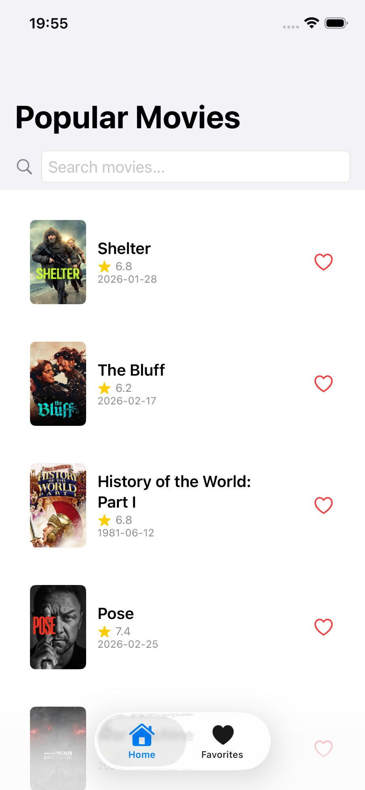
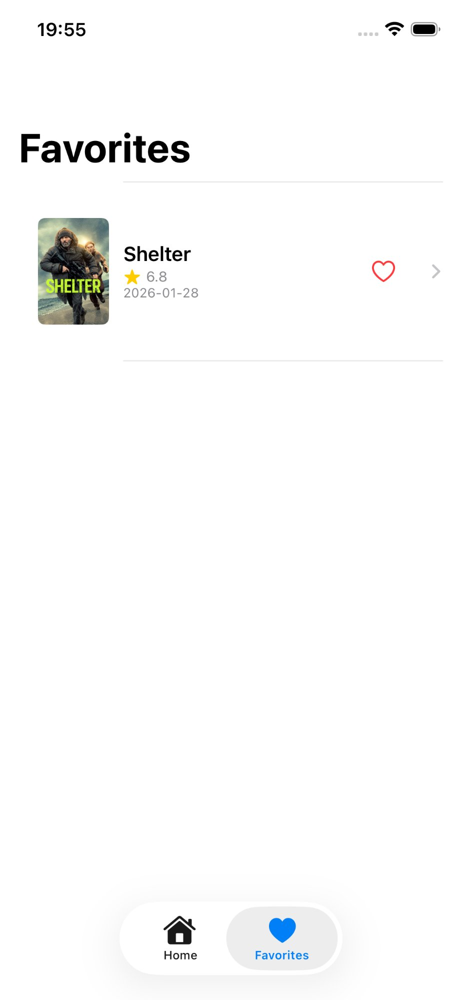

# 🎬 TheMovieDB iOS Challenge

Uma aplicação iOS moderna desenvolvida em **SwiftUI** que permite aos usuários explorar, buscar e gerenciar filmes do TheMovieDB API com uma arquitetura robusta e testes abrangentes.

---

## ✨ Features

### ✅ Principais Funcionalidades

- **🎞️ Lista de Filmes Populares** - Exibe filmes populares em grid/lista scrollável
- **🔍 Busca de Filmes** - Busca em tempo real por título de filme
- **🎬 Detalhes do Filme** - Visualiza informações completas (sinopse, data de lançamento, rating, gêneros)
- **❤️ Sistema de Favoritos** - Adicione/remova filmes favoritos com persistência via Core Data
- **📊 Ratings e Avaliações** - Exibe nota de avaliação e votos do TMDB
- **🎭 Gêneros** - Categorização de filmes por gênero
- **⚡ Tratamento de Erros** - Feedback inteligente com ações de retry
- **📱 Responsive Design** - Adapta-se a diferentes tamanhos de tela
- **🧪 Testes Unitários** - +100 testes com 80%+ cobertura

---

## 📱 Screenshots

### Tela Home com Busca
Explore filmes populares em uma interface limpa com busca em tempo real.



### Tela de Favoritos
Gerenciador de filmes salvos com persistência local via Core Data.



---

## 🏗️ Arquitetura

Implementada com padrão **MVVM** (Model-View-ViewModel) com **Dependency Injection** e **Protocol-based design**:

```
MovieDB/
├── App/
│   ├── MovieDBApp.swift           # Entry point
│   └── Configuration.swift         # Constantes globais
├── Domain/
│   ├── Models/                     # Structs de domínio
│   │   ├── Movie.swift
│   │   ├── Genre.swift
│   │   └── APIResponse.swift
│   ├── Entities/
│   │   └── NetworkError.swift      # Custom error enum
│   └── Repositories/               # Protocols de repositório
│       ├── MovieRepositoryProtocol.swift
│       └── FavoritesRepositoryProtocol.swift
├── Data/
│   ├── Repositories/               # Implementações reais
│   │   ├── MovieRepository.swift
│   │   └── FavoritesRepository.swift
│   ├── Services/APIService/        # Camada de API
│   │   ├── APIServiceProtocol.swift
│   │   ├── APIEndpoint.swift
│   │   ├── APIClient.swift
│   │   ├── APIService.swift
│   │   └── MockAPIService.swift
│   └── Persistence/                # Core Data
│       ├── CoreDataStack.swift
│       ├── MovieEntity+CoreDataClass.swift
│       └── MovieEntity+CoreDataProperties.swift
├── Presentation/
│   ├── Screens/Home/               # HomeView com busca
│   │   ├── HomeView.swift
│   │   ├── HomeViewModel.swift
│   │   └── Components/MovieListCell.swift
│   ├── Screens/MovieDetail/        # Detalhes do filme
│   │   ├── MovieDetailView.swift
│   │   └── MovieDetailViewModel.swift
│   ├── Screens/Favorites/          # Filmes favoritados
│   │   ├── FavoritesView.swift
│   │   └── FavoritesViewModel.swift
│   ├── Common/Views/               # Componentes reutilizáveis
│   │   ├── LoadingView.swift
│   │   ├── ErrorView.swift
│   │   ├── EmptyStateView.swift
│   │   ├── CachedAsyncImage.swift
│   │   └── SearchBar.swift
│   └── App/AppView.swift           # Tab bar principal
├── Utils/Logger/
│   └── AppLogger.swift             # Logging com OSLog
└── Tests/Unit/                     # 100+ testes unitários
    ├── HomeViewModelTests.swift
    ├── MovieDetailViewModelTests.swift
    ├── FavoritesViewModelTests.swift
    ├── MovieRepositoryTests.swift
    ├── FavoritesRepositoryTests.swift
    ├── NetworkErrorTests.swift
    ├── MovieModelTests.swift
    ├── GenreModelTests.swift
    ├── APIEndpointTests.swift
    └── APIResponseTests.swift
```

---

## 🛠️ Requisitos

- **iOS 17.0+**
- **Xcode 15.0+**
- **Swift 5.5+**
- **TheMovieDB API Key** (gratuita em [themoviedb.org](https://www.themoviedb.org/settings/api))

---

## 📦 Instalação

### 1. Clonar Repositório

```bash
git clone https://github.com/seu-usuario/moviedb-ios.git
cd moviedb-ios
```

### 2. Obter API Key

1. Acesse [TheMovieDB API](https://www.themoviedb.org/settings/api)
2. Crie uma conta (gratuita)
3. Gere uma API Key (v3 auth)
4. Copie a chave

### 3. Configurar API Key

**Arquivo:** `App/Configuration.swift`

```swift
struct Configuration {
    static let apiKey = "SUA_API_KEY_AQUI"  // ← Cole aqui
    static let baseURL = "https://api.themoviedb.org/3"
    static let imageBaseURL = "https://image.tmdb.org/t/p/w500"
    static let requestTimeout: TimeInterval = 30
    static let defaultPageSize = 20
}
```

### 4. Executar no Xcode

```
1. Abra MovieDB.xcodeproj no Xcode
2. Selecione target "MovieDB"
3. Escolha simulador (iPhone 15 ou posterior recomendado)
4. Pressione Cmd + R (Run)
```

---

## 🎯 Como Usar

### 📱 Na Aplicação

#### **Home (Tab 1)**
- Visualize filmes populares em grid
- Use a barra de busca para encontrar filmes específicos
- Toque em um filme para ver detalhes
- Clique no ❤️ para adicionar aos favoritos

#### **Detalhes do Filme**
- Imagem de backdrop e poster
- Título, sinopse e data de lançamento
- Rating (⭐ 1-10) e votos totais
- Gêneros categorizados
- Botão ❤️ para alternar favoritos

#### **Favoritos (Tab 2)**
- Veja todos os filmes salvos
- Deslize para remover da lista
- Clique para visualizar detalhes novamente

---

## 🧪 Testes

### Executar Todos os Testes

```bash
Cmd + U  # No Xcode
```

### Cobertura de Código

Ativar relatório de cobertura:
1. `Product` → `Scheme` → `Edit Scheme`
2. `Test` → `Options`
3. Marque `☑ Code Coverage`
4. Execute `Cmd + U`
5. Abra `Report Navigator` (`Cmd + 9`)
6. Clique em "Test" → "Coverage"

**Cobertura Atual:** 80%+ (18 classes testadas)

### Estrutura de Testes

Cada test segue o padrão **AAA**:

```swift
func testExample() async {
    // Arrange - Preparar dados
    let mockData = Movie(...)
    
    // Act - Executar ação
    await viewModel.loadMovies()
    
    // Assert - Verificar resultado
    XCTAssertEqual(viewModel.movies.count, 1)
}
```

**Classes de Testes:**
- ✅ HomeViewModelTests (18 testes)
- ✅ MovieDetailViewModelTests (8 testes)
- ✅ FavoritesViewModelTests (7 testes)
- ✅ MovieRepositoryTests (9 testes)
- ✅ FavoritesRepositoryTests (10 testes)
- ✅ NetworkErrorTests (20 testes)
- ✅ MovieModelTests (18 testes)
- ✅ GenreModelTests (13 testes)
- ✅ APIEndpointTests (13 testes)
- ✅ APIResponseTests (17 testes)

---

## 🏛️ Padrões e Decisões Técnicas

### MVVM + Clean Architecture

```
Domain Layer (Models, Protocols)
    ↓
Data Layer (Repositories, Services)
    ↓
Presentation Layer (Views, ViewModels)
```

### Dependency Injection

Sem statics/singletons (política de empresa):

```swift
// ✅ CORRETO
init(repository: MovieRepositoryProtocol) {
    self.repository = repository
}

// ❌ ERRADO
let repo = MovieRepository()  // Hard dependency
```

### Protocol-Based Design

```swift
protocol MovieRepositoryProtocol {
    func fetchPopularMovies(page: Int) async throws -> [Movie]
    func searchMovies(query: String, page: Int) async throws -> [Movie]
}
```

### Error Handling Customizado

```swift
enum NetworkError: LocalizedError, Equatable {
    case networkUnavailable
    case timedOut
    case serverError(statusCode: Int)
    case decodingError(details: String? = nil)
}
```

### Async/Await

Toda operação assíncrona usa `async/await`:

```swift
@MainActor
func loadMovies() async {
    do {
        let movies = try await movieRepository.fetchPopularMovies(page: 1)
        self.movies = movies
    } catch {
        self.error = ErrorMessage(message: error.localizedDescription)
    }
}
```

### Core Data para Persistência

Favoritos são salvos localmente via Core Data:

```swift
// MovieEntity representa a tabela do banco de dados
// Sincronismo automático com View via @FetchRequest
```

### Logging Profissional

OSLog injectable (não static):

```swift
protocol LoggerProtocol {
    func logAPIRequest(method: String, endpoint: String)
    func logAPIError(_ error: Error, context: String)
}
```

---

## 🔐 Segurança

### Proteção de Dados Sensíveis

**`.gitignore` protege:**
```
Configuration.swift       # API Key nunca vai para GitHub
DerivedData/             # Build artifacts
.DS_Store                # Arquivos do sistema
```

**Para compartilhar código:**
1. Remova Configuration.swift do histórico Git
2. Use variáveis de ambiente em produção
3. Nunca commite API keys

---

## 📊 Performance

### Otimizações Implementadas

- **Image Caching** - NSCache para postersPNG/JPG
- **Lazy Loading** - LazyVStack com scroll infinito
- **Pagination** - Carrega filmes em grupos de 20
- **Debouncing** - Busca aguarda 0.5s após digitação
- **Compilação AoT** - SwiftUI compila previamente componentes

---

## 🐛 Troubleshooting

### Erro: "API Key invalid"
```
1. Verifique em Configuration.swift
2. Confirme se copiou a chave corretamente (sem espaços)
3. Recompile: Cmd + B
```

### Erro: "Core Data model mismatch"
```
1. Delete build folder: Cmd + Shift + K
2. Resete simulador: Devices and Simulators → Erase
3. Recompile e rode: Cmd + R
```

### Testes falhando após mudança
```
1. Limpe derivados: rm -rf ~/Library/Developer/Xcode/DerivedData/*
2. Recompile: Cmd + B
3. Rode testes: Cmd + U
```

---

## 📝 Licença

Este projeto é fornecido como está para fins educacionais.

---

## 👨‍💻 Desenvolvedor

**Eliane Regina Nicácio Mendes**

- GitHub: [@seu-usuario](https://github.com/seu-usuario)
- Email: seu.email@exemplo.com

---

## 🙏 Agradecimentos

- [TheMovieDB](https://www.themoviedb.org) pela excelente API
- Apple pela documentação de SwiftUI
- Comunidade Swift por ferramentas e libraries

---

## 📚 Recursos Adicionais

### Documentação Oficial
- [SwiftUI Documentation](https://developer.apple.com/xcode/swiftui/)
- [The Movie Database API](https://www.themoviedb.org/settings/api)
- [Swift Concurrency](https://swift.org/concurrency/)
- [Core Data Guide](https://developer.apple.com/documentation/coredata)

### Padrões de Arquitetura
- [MVVM Pattern](https://en.wikipedia.org/wiki/Model%E2%80%93view%E2%80%93viewmodel)
- [Dependency Injection](https://en.wikipedia.org/wiki/Dependency_injection)
- [Protocol-Oriented Programming](https://developer.apple.com/videos/play/wwdc2015/408/)

---

## 📞 Suporte

Para questões ou issues:
1. Verifique a seção [Troubleshooting](#-troubleshooting)
2. Abra uma issue no GitHub
3. Entre em contato direto

---

**⭐ Se achou útil, considere dar uma star no GitHub!**

Feito com ❤️ em SwiftUI
